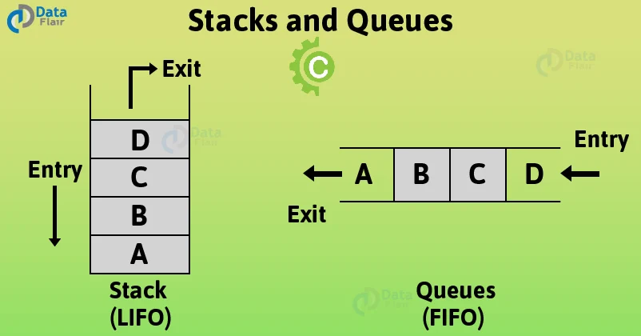

# C - Stacks, Queues - LIFO, FIFO


<dl>
<dt>FIFO: First In, First Out</dt>
<dd>The first element to be inserted into the data structure is accessed first when accessing the data structure and so on.
</dd>
<dt>LIFO: Last In, First Out</dt>
<dd>The last element to be inserted into the data structure is accessed first when accessing the data structure
</dd>
</dl>

## Stack

A linear data structure implementing a LIFO approach where both insertion and deletion take place from just one end, that is, from the top.

### Implementation

Can be:

* **static** - _array_ is used, memory statically allocated meaning size of the stack should be known beforehand
* **dynamic** - _linked list_ is used, memory is dynamically allocated at run time.

## Queue

A data structure implmenting a FIFO approach

### The Monty Language

Monty 0.98 is a scripting language that is first compiled into Monty byte codes (Just like Python). It relies on a unique stack, with specific instructions to manipulate it. The goal of this project is to create an interpreter for Monty ByteCodes files.

#### Monty byte code files

Files containing Monty byte codes usually have the `.m` extension. Most of the industry uses this standard but it is not required by the specification of the language.

* There is not more than one instruction per line.
* There can be any number of spaces before or after the opcode and its argument.
* Any additional text after the opcode or its required argument is not taken into account
* Monty byte code files can contain blank lines (empty or made of spaces only)

**Example file:**

```bash
cat bytecodes/000.m
push 0
push 1
push 2
  push 3
                   pall    
push 4
    push 5    
      push    6        
pall
```

#### monty interpreter

Compilation:

```bash
gcc -Wall -Werror -Wextra -pedantic -std=c89 *.c -o monty
```

Usage:

```bash
./monty file
```

`file` is the path to the file containing Monty byte code.

The monty program runs the bytecodes line by line and stop if either:

* it executed properly every line of the file
* it finds an error in the file
* an error occured
